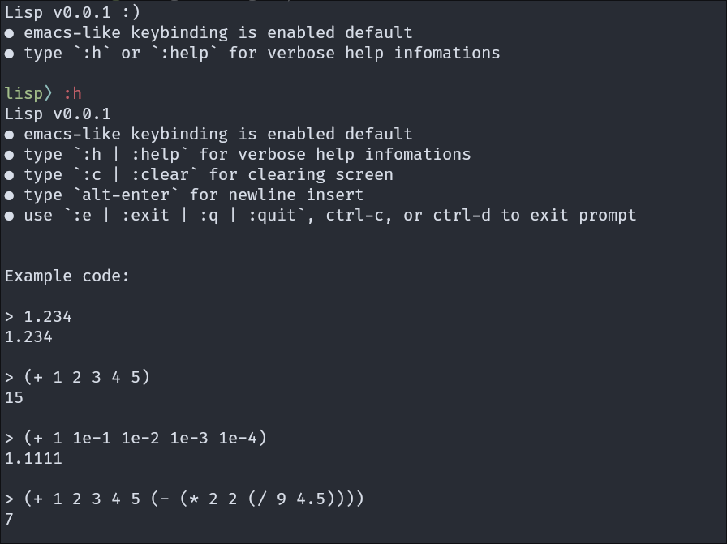

# Lisp 

## Intro

My toy lisp language.  

Type `cargo r -p repl` to start REPL.  
Type `cargo r -p lang examples/plug.lisp` to run example code.

## Examples:

- fib.lisp:

```scheme
(define (fib n) (cond
  ((= n 0) 0)
  ((= n 1) 1)
  (+ (fib (- n 1)) (fib (- n 2)))
))

(displayln (fib 10))
```

- big-sum.lisp:

```scheme
(define (min x y)
  (if (< x y) x y))

(define (big-sum x y z)
    (- (+ x y z)
       (min (min x y) z)))
  
(displayln (big-sum 2 3 4))
```

- sqrt.lisp:

```scheme
(define (square x)
  (* x x))

(define (abs x)
  (if (> x 0) x (- x)))

(define (average x y)
  (/ (+ x y) 2))

(define (improve guess x)
  (average guess (/ x guess)))

(define (good-enough? old-guess guess)
  (> 0.01
    (/ (abs (- guess old-guess))
        old-guess)))

(define (sqrt-iter guess x)
  (if (good-enough? guess (improve guess x))
    (improve guess x)
    (sqrt-iter (improve guess x) x)))

(define (sqrt x)
  (sqrt-iter 1.0 x))

(displayln (sqrt 2))
```

- plus.lisp:

```scheme
(define (inc n)
  (+ n 1))

(define (dec n)
  (- n 1))

(define (plus1 a b)
  (if (= a 0)
    b
    (inc (plus1 (dec a) b))))

(define (plus2 a b)
  (if (= a 0)
    b
    (plus2 (dec a) (inc b))))

(displayln (plus1 4 5))
(displayln (plus2 4 5))
```

# Showcase


